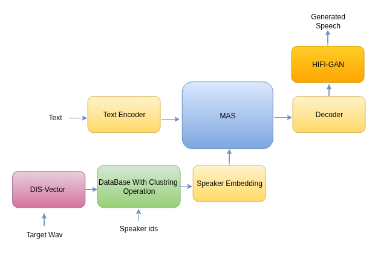

# DIS-VECTOR: AN EFFECTIVE APPROACH FOR CONTROLLABLE ZERO-SHOT VOICE CONVERSION AND CLONING IN LOW-RESOURCE LANGUAGES 🎤✨

Welcome to the DIS-Vector project! This repository presents an advanced low-resource, zero-shot voice conversion and cloning model that leverages disentangled embeddings, clustering techniques, and language-based similarity matching to achieve highly natural and controllable voice synthesis.

The **DIS-Vector** model introduces a novel approach to voice conversion by disentangling speech components content, pitch, rhythm, and timbre into separate embedding spaces, enabling fine-grained control over voice synthesis. Unlike traditional voice conversion models, DIS-Vector is capable of zero-shot voice cloning, meaning it can synthesize voices from unseen speakers and languages without requiring large-scale speaker-specific training data.

We have Approach 1, which is the base version of DIS-Vector. The details are provided [here](https://github.com/NN-Project-1/dis-Vector-Embedding/blob/main/readme1.md).

---

## 📚 Table of Contents
1. [Overview](#1-overview)  
2. [Dis-Vector Model Details](#2-dis-vector-model-details)
3. [Length Analysis](#5-length-analysis)  
4. [TTS Integration](#3-vits-tts-integration)  
5. [Speech Component Representation](#6-speech-component-representation)  
6. [Types of Loss Functions](#7-types-of-loss-functions)  
7. [Evaluation](#8-evaluation)  
   1. [Test Setup](#81-test-setup)  
   2. [Distance Measurement](#82-distance-measurement)  
   3. [Ground Truth vs. TTS Output Similarity](#83-ground-truth-vs-tts-output-similarity)  
8. [Clustering & Language Matching](#9-clustering--language-matching)  
   1. [K-Means Clustering for Speaker Embeddings](#91-k-means-clustering-for-speaker-embeddings)  
   2. [Language-Based Similarity Matching](#92-language-based-similarity-matching)  
   3. [Closest Language Matching During Inference](#93-closest-language-matching-during-inference)

---

## 1. Overview
The Dis-Vector model represents a significant advancement in voice conversion and synthesis by employing disentangled embeddings and clustering methodologies to precisely capture and transfer speaker characteristics. It introduces a novel **language-based similarity approach** and **K-Means clustering** for efficient speaker retrieval and closest language matching during inference.

### Features
- **Disentangled Embeddings**: Separate encoders for content, pitch, rhythm, and timbre.  
- **Zero-Shot Capabilities**: Effective voice cloning and conversion across different languages.  
- **High-Quality Synthesis**: Enhanced accuracy and flexibility in voice cloning.  
- **K-Means Clustering**: Optimized speaker embedding retrieval for inference.  
- **Language-Based Similarity Matching**: Determines the closest match from the embedding database to improve synthesis quality.  

### Sample Output Demo
Explore our [live demo here](https://nn-project-1.github.io/dis-vector_web/) showcasing the capabilities of the Dis-Vector model! Users can listen to synthesized audio samples highlighting accurate replication and transformation of speaker characteristics.

## 2. Dis-Vector Model Details
The DIS-Vector model is a multi-encoder disentanglementbased speech representation framework developed for expressive, cross-lingual, and zero-shot voice conversion. The design goal is to separate key aspects of human speech content, pitch, rhythm, and timbre into distinct, independently controllable latent embeddings. This architecture enables precise manipulation of each speech attribute while maintaining perceptual coherence in synthesis, allowing natural-sounding speaker conversion and expressive style transfer without retraining.

  

DIS-Vector follows a **parallel encoder structure** in which each encoder extracts a distinct feature domain from synchronized mel-spectrogram frames represented as `[B, T, F]`, where `B` is batch size, `T` denotes sequence length, and `F` represents mel-frequency bins. The four encoders content, pitch, rhythm, and timbre operate concurrently to generate their respective latent representations. These outputs are concatenated into a single **512-dimensional embedding vector**, forming a unified disentangled speech representation suitable for downstream decoding and synthesis.

### Encoder Specifications  

#### Content Encoder  

The **Content Encoder** captures linguistic and phonetic structures that define the spoken message while remaining independent of speaker characteristics. It utilizes a **hybrid CNN–LSTM architecture**. The convolutional layers model local spectral correlations and phonetic transitions from short-term mel segments, whereas the LSTM layers preserve long-term linguistic continuity across frames. This combination ensures that both spectral detail and sequential context are effectively represented.

The convolutional stack contains several 1D convolutional layers with kernel sizes between 3 and 5, followed by ReLU activation and layer normalization. The LSTM network, with a hidden dimension of 256, processes these convolutional outputs sequentially to generate a **256-dimensional content latent vector** (`z_c`). This latent vector encodes the phoneme-level linguistic structure necessary for accurate speech reconstruction and style independent synthesis.

#### Pitch Encoder  

The **Pitch Encoder** focuses on modeling the **fundamental frequency (F₀)** contour and tonal variations that determine intonation and expressiveness. It employs a **CNN–LSTM design** similar to the content encoder. The convolutional layers extract frequency periodicity and harmonic structure from mel-spectrogram inputs, while the LSTM captures frame-to-frame pitch progression and smooth tonal movement.

The F₀ contour is first extracted from the waveform using a pitch estimation algorithm such as **PyWorld**, followed by log-normalization and alignment with mel frames. The CNN captures harmonic energy variations, and the LSTM models dynamic changes over time. The resulting **128-dimensional pitch latent vector** (`z_p`) represents tonal shape, direction, and smoothness while suppressing speaker-specific spectral effects. This latent serves as a precise prosodic descriptor, enabling tonal transfer across different speakers without losing natural pitch consistency.

#### Rhythm Encoder  

The **Rhythm Encoder** models the temporal structure of speech at the **frame level**, focusing on the timing, duration, and energy variations that define rhythmic patterns. The input mel-spectrogram sequence is processed using a **CNN–LSTM architecture** designed to learn both local and sequential temporal cues. The convolutional layers extract short-range frame-level amplitude modulations and energy transitions corresponding to syllable boundaries and intra-word timing. Each convolutional operation is followed by ReLU activation and layer normalization to stabilize feature scaling across frames.

The convolutional output sequence is passed to the LSTM network, which operates over the same frame-aligned time axis. The LSTM captures extended dependencies between consecutive frames, modeling duration patterns, inter-phoneme gaps, and rhythmic continuity across the entire utterance. During training, frame-level duration labels are obtained from **forced alignment outputs** (e.g., Montreal Forced Aligner), where each mel frame is explicitly aligned to its corresponding phoneme boundary. These aligned frame-level mappings enable the LSTM to learn the precise temporal distribution of speech frames.

The final hidden state sequence from the LSTM is mean-pooled across frames to obtain a **64-dimensional rhythm latent vector (`z_r`)**. This vector encodes detailed timing features, including speech rate, stress placement, and pause distribution. During synthesis, `z_r` determines frame-level timing control, allowing modification of utterance pacing and duration patterns while preserving the linguistic and pitch characteristics encoded in other latent representations.

#### Timbre Encoder  

The **Timbre Encoder** processes mel-spectrogram sequences at the frame level to extract speaker specific spectral features that define vocal identity, resonance, and spectral coloration. The encoder is implemented using a **Transformer-based architecture** optimized for long range dependency modeling across both frequency and temporal dimensions. Each Transformer block consists of **multi-head self-attention (MHSA)**, **position-wise feed-forward layers**, **layer normalization**, and **residual connections**. The MHSA mechanism computes attention weights across all time–frequency positions, allowing each frame embedding to integrate spectral context from the entire utterance.

During processing, mel-spectrogram frames are linearly projected into a fixed embedding space and combined with positional encodings that preserve frame order. The attention module analyzes correlations between frequency bands, capturing resonance and spectral envelope patterns that distinguish one speaker from another. Feed-forward sublayers apply non-linear transformations to refine feature separability, while residual normalization stabilizes gradient flow during training. The output of the final Transformer layer is mean-pooled across frames to generate a fixed-length **64-dimensional timbre latent vector (`z_t`)**. This latent vector represents the static and dynamic timbral attributes that uniquely characterize the speaker’s voice, including vocal tract shape, formant structure, and spectral slope behavior.

After all encoders complete their feature extraction, the resulting latent vectors are concatenated to form a unified **512-dimensional composite representation** defined as:

                                             z_DIS = [z_c; z_p; z_r; z_t]

### Decoder and Reconstruction  

The **Decoder** performs frame-level mel-spectrogram reconstruction from the unified 512-dimensional **DIS-vector** `[z_c; z_p; z_r; z_t]`. The input vector sequence is first linearly projected and temporally expanded to match the original frame resolution. This projection initializes the decoder input sequence, where each frame embedding represents the fused acoustic state derived from content, pitch, rhythm, and timbre components.

The decoder architecture is implemented using **stacked Transformer-based upsampling blocks** followed by **convolutional refinement layers**. Each Transformer block consists of multi-head self-attention (MHSA), feed-forward sublayers, and residual normalization. The MHSA mechanism computes attention weights over all frame positions, allowing each reconstructed frame to access long-range contextual information across the entire utterance. This operation models inter-frame dependencies in both temporal and spectral dimensions, ensuring that transitions between phonemes and prosodic segments remain continuous.

Following the attention layers, temporal upsampling is performed through learned linear interpolation modules that double the frame resolution at each stage. This process restores the original temporal resolution of the mel-spectrogram without loss of synchronization. After upsampling, **1D convolutional refinement layers** with kernel size 5 are applied to each frame sequence to enhance local spectral resolution and correct frame-level distortions. These convolutional layers reconstruct harmonic detail and formant structure from the encoded latent features.

The decoder output is a sequence of mel-spectrogram frames `Ŝ ∈ ℝ^{T×F}`, where each frame corresponds directly to its original temporal index. The reconstructed spectrogram is then converted into the final waveform using a pretrained **HiFi-GAN neural vocoder** operating in 22.05 kHz sampling mode. The vocoder synthesizes waveform samples directly from the decoder’s mel output, preserving amplitude envelope and spectral envelope consistency.  

This reconstruction flow maintains strict frame-level alignment between input latents and output acoustics, ensuring that content, pitch, rhythm, and timbre information are coherently mapped to the final audio representation without cross-domain interference.

## 3. Length Analysis 

Ablation experiments were conducted to determine the optimal latent dimensionality for the unified DIS-vector representation. The embedding dimension directly affects the model’s ability to encode disentangled acoustic information across linguistic, prosodic, rhythmic, and timbral domains. Models were trained with varying latent sizes 256, 512, 768, and 1024 dimensions under identical training conditions and data configurations.  

At 256 dimensions, the reduced latent capacity led to significant degradation in reconstruction fidelity, particularly in representing timbral richness and cross-speaker spectral variations. The decoder exhibited over-smoothing effects in the high-frequency regions, indicating insufficient embedding granularity to retain speaker-specific nuances.  

Increasing the latent dimension to 768 and 1024 improved information retention marginally but introduced redundancy across latent channels. These higher-dimensional variants resulted in slower convergence rates and unstable disentanglement behavior, as excessive capacity allowed overlapping feature representations between pitch, rhythm, and timbre subspaces.  

Empirical evaluation showed that 512-dimensional embeddings provided an optimal trade-off between representational richness and computational efficiency. This configuration maintained high perceptual quality while ensuring stable convergence across training epochs. The 512D latent space demonstrated sufficient discriminative power to separate linguistic, prosodic, and speaker-dependent information without introducing redundancy. Consequently, the final DIS-vector architecture employs a **512-dimensional unified representation**, experimentally validated as the most balanced and efficient configuration for precise and interpretable acoustic disentanglement.

## 4. TTS Integration

Integrating the DIS-Vector framework within modern TTS systems enhances synthesis controllability and disentanglement across linguistic, prosodic, and timbral domains. The unified 512-dimensional latent vector acts as a conditioning signal that independently modulates acoustic, rhythmic, and phonetic representations within the synthesis pipeline. This section describes the integration of DIS-Vector with **TTS** (VITS-based) and **GPT-TTS**, focusing on architectural details and embedding-level interaction mechanisms.  

### 4.1 VITS Integration  

  

The **VITS architecture** is extended with disentangled speech embeddings from DIS-Vector to enable multi-speaker, zero-shot, and cross-lingual speech synthesis. The VITS model consists of three core components: a **text encoder**, a **posterior encoder**, and a **flow-based decoder combined with a HiFi-GAN vocoder**.  

The **text encoder** is implemented as a combination of convolutional layers and Transformer blocks. The convolutional layers extract local phonetic patterns and short-term dependencies from the input phoneme or grapheme sequences, while the Transformer layers model long-range dependencies and contextual information across the entire utterance. The text encoder outputs a frame-level sequence of **linguistic priors**, which serve as the basis for mapping phonemes to acoustic frames in the synthesis process.

The **posterior encoder** is an LSTM-based network that processes ground-truth mel-spectrograms to generate **latent posterior variables** aligned at the frame level. The LSTM captures temporal dependencies across acoustic frames, encoding prosodic dynamics such as pitch contour and rhythm. In the integrated pipeline, the pitch (`z_p`) and rhythm (`z_r`) latents from the DIS-Vector are injected into the posterior encoder outputs using **Adaptive Instance Normalization (AdaIN)** and **Feature-wise Linear Modulation (FiLM)** layers. This frame-level conditioning allows the model to reproduce fine-grained F₀ variations, syllabic timing, and energy patterns without requiring explicit prosody supervision.

The **flow-based decoder** converts the latent posterior distribution into the acoustic prior, which is then decoded into mel-spectrogram frames. The timbre latent (`z_t`) is injected as a speaker-defining variable into the flow-based decoder. This conditioning modulates the affine coupling layers and the normalizing flow transformations, enabling precise control over spectral envelope, formant structure, and harmonic content. Following mel-spectrogram generation, the **HiFi-GAN vocoder** synthesizes the time-domain waveform. The same timbre latent is applied within the vocoder layers to maintain consistency of spectral texture and harmonic structure across frames.

The **integration of DIS-Vector embeddings** into VITS occurs across the entire pipeline. The content latent (`z_c`) is concatenated with text encoder outputs to align linguistic features with frame-level acoustic priors. The pitch and rhythm latents modulate posterior encoder outputs to encode temporal and prosodic dynamics. The timbre latent shapes the decoder and vocoder outputs, ensuring speaker-specific spectral fidelity. During inference, this architecture allows zero-shot voice cloning by replacing the timbre subvector with embeddings extracted from unseen speakers, maintaining the original content, rhythm, and prosody. This design transforms VITS into a fully disentangled generative model capable of independent control over content, rhythm, pitch, and speaker identity, while preserving end-to-end high-fidelity synthesis.

### 4.2 GPT-TTS Integration

  

The **GPT-based TTS** model implements an autoregressive text-to-acoustic generation pipeline using a Transformer decoder trained on discrete latent representations obtained from a **Vector-Quantized Variational Autoencoder (VQ-VAE)**. Input text is first tokenized using **Byte-Pair Encoding (BPE)**, producing subword units that are mapped into dense embeddings. These embeddings are processed through stacked **Transformer decoder blocks**, each trained to predict the next discrete acoustic token in the sequence.

The **DIS-Vector** provides a 512-dimensional conditioning signal for both linguistic alignment and speaker-specific acoustic modulation. This latent vector is projected to match the Transformer embedding dimension and applied through two complementary mechanisms. First, the projected DIS-Vector is concatenated with input token embeddings at every timestep, ensuring each autoregressive step incorporates explicit content, prosody, and timbre information. Second, the same latent is used for **Feature-wise Linear Modulation (FiLM)**, generating scale and shift coefficients that modulate the Transformer feed-forward and attention activations, enabling fine-grained control over pitch contour, rhythm, and spectral texture.

The decoder predicts sequences of discrete VQ indices representing quantized mel-spectrogram segments. These indices are subsequently decoded by the VQ-VAE decoder into frame-level acoustic features. A pretrained **HiFi-GAN vocoder** synthesizes the final waveform from these features, conditioned by the same DIS-Vector embeddings to maintain consistency across linguistic, prosodic, and speaker dimensions.

By integrating DIS-Vector embeddings, the system supports **zero-shot voice cloning** and cross-lingual synthesis. The timbre and rhythm components can be replaced with embeddings extracted from unseen speakers, allowing the model to preserve content and linguistic accuracy while adapting prosody and spectral characteristics. This framework enables expressive, controllable speech generation with precise frame-level alignment between textual input and acoustic output.

## 5. Speech Component Representation

A speech signal \( s(t) \) is decomposed into four components:

  

- **C(t) (Content):** Linguistic information  
- **P(t) (Pitch):** Fundamental frequency \( F_0 \)  
- **R(t) (Rhythm):** Duration and timing patterns  
- **T(t) (Timbre):** Speaker identity characteristics  

## 6. Types of Loss Functions

- **Mean Squared Error (MSE) Loss**: Minimizes difference between predicted and actual continuous components.  

  

- **Kullback-Leibler (KL) Divergence Loss**: Measures difference between distributions, ensures embedding alignment.  

  

- **Disentanglement Loss**: Ensures embeddings (content, pitch, rhythm, timbre) remain distinct.  

  

Where:  
- **L_content**: Linguistic consistency  
- **L_pitch**: Preserves F0  
- **L_rhythm**: Maintains timing  
- **L_timbre**: Preserves speaker identity  

## 7. Evaluation

### 7.1 Test Setup

  

- **Pitch Testing**: Pitch Error Rate (PER)  
- **Rhythm Testing**: Rhythm Error Rate (RER)  
- **Timbre Testing**: Timbre Error Rate (TER)  
- **Content Testing**: Content Preservation Rate (CPR)  

### 7.2 Distance Measurement
- **Cosine Similarity**: Evaluates feature transfer and voice synthesis  

### 7.3 Ground Truth vs. TTS Output Similarity
- Measures similarity in pitch, rhythm, timbre, and content  

## 8. Clustering & Language Matching

### 8.1 K-Means Clustering for Speaker Embeddings
Dis-Vector utilizes a **language-annotated speaker embedding database**, where each speaker is mapped to a distinct feature representation based on their **timbre and prosody characteristics**. To enable efficient **cross-speaker and cross-language voice conversion**, we apply **K-Means clustering** on these high-dimensional embeddings. This clustering process helps to:

- **Group speakers** based on intrinsic vocal attributes such as pitch, intonation, and articulation patterns.
- **Enable zero-shot voice conversion** by leveraging cluster-based matching, even for unseen speakers.
- **Assign cluster centroids as representative embeddings**, allowing the system to select the closest match for synthesis.
- **Improve generalization and adaptation** by ensuring robust speaker variation capture while maintaining speaker identity.

By organizing the embedding space into well-defined clusters, Dis-Vector ensures a more structured and interpretable representation of speaker embeddings, enhancing the **quality and accuracy of voice conversion**.

### 8.2 Language-Based Similarity Matching

During inference, the model selects the **most suitable speaker embedding** by computing **cosine similarity** between the **target speaker’s embedding** and the **pre-clustered speaker embeddings** in the database. This method prioritizes selecting a **linguistically similar speaker**, leading to:

- **Better prosody preservation**, as speakers from the same linguistic background share similar pitch and rhythm structures.
- **Accurate voice adaptation**, ensuring that even when a target speaker’s language is unseen during training, the system can infer the best match.
- **Efficient feature transfer**, allowing for natural-sounding synthesis without distorting speaker identity.

The language-based similarity approach refines the voice conversion process by focusing on both **speaker similarity and linguistic consistency**, ensuring the most **natural and high-quality voice generation**.

### 8.3 Closest Language Matching During Inference
o further enhance cross-lingual voice adaptation, Dis-Vector integrates a **nearest language matching** strategy. Given a target speaker's embedding, the system performs the following steps:

1. **Determine the closest linguistic cluster** by measuring the embedding distance to pre-computed cluster centroids.
2. **Apply a threshold-based similarity measure** to ensure the closest linguistic match is selected.
3. **If a direct match is unavailable**, the system chooses a linguistically nearest neighbor based on phonetic and prosody similarities.

This technique ensures:
- **Minimal loss in speech naturalness** by selecting speakers with the most similar phonetic structures.
- **Improved speaker adaptation**, even in cases where the target speaker’s language is underrepresented in the dataset.
- **Scalability for zero-shot voice conversion**, allowing seamless expansion with new speakers and languages.

By leveraging this clustering-based framework, Dis-Vector significantly improves the accuracy and efficiency of voice conversion in **multilingual and low-resource language settings**, making it a robust solution for **global voice synthesis applications**.

## 9. DIS-VECTOR: Controllable Zero-Shot Voice Conversion & Cloning Features

✅ **Zero-Shot Voice Conversion**  
✅ **Low-Resource Language Adaptation**  
✅ **Cross-Gender Voice Cloning**  
✅ **Cross-Lingual Voice Cloning**  
✅ **Indian Language Adaptation**  
            → Supports major Indian languages like Hindi, Tamil, Telugu, Malayalam, and Bengali.  
✅ **Disentangled Embedding Control**  
✅ **Language-Based Similarity Matching**  
✅ **Feature Transfer Mechanism**  
→ Transfer **content**, **pitch**, **rhythm**, and **timbre** between any two speakers.  

For more details, refer to the documentation. 🚀

