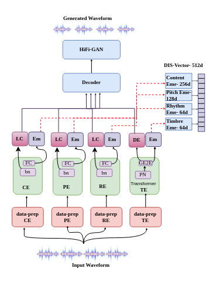
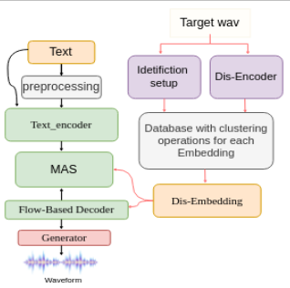
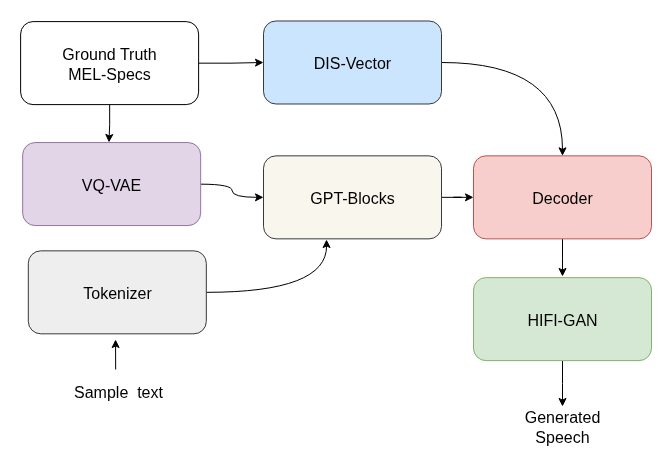
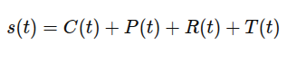
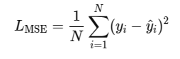
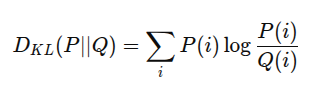
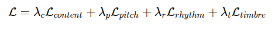
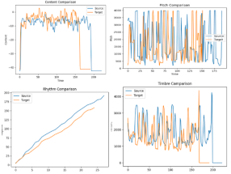

# DIS-VECTOR: AN EFFECTIVE APPROACH FOR CONTROLLABLE ZERO-SHOT VOICE CONVERSION AND CLONING IN LOW-RESOURCE LANGUAGES 🎤✨

Welcome to the DIS-Vector project! This repository presents an advanced low-resource, zero-shot voice conversion and cloning model that leverages disentangled embeddings, clustering techniques, and language-based similarity matching to achieve highly natural and controllable voice synthesis.

The **DIS-Vector** model introduces a novel approach to voice conversion by disentangling speech components content, pitch, rhythm, and timbre into separate embedding spaces, enabling fine-grained control over voice synthesis. Unlike traditional voice conversion models, DIS-Vector is capable of zero-shot voice cloning, meaning it can synthesize voices from unseen speakers and languages without requiring large-scale speaker-specific training data.

We have Approach 1, which is the base version of DIS-Vector. The details are provided [here](https://github.com/NN-Project-1/dis-Vector-Embedding/blob/main/readme1.md).

  

---

## 📚 Table of Contents
1. [Overview](#1-overview)  
2. [Dis-Vector Model Details](#2-dis-vector-model-details)  
3. [VITS-TTS Integration](#3-vits-tts-integration)  
4. [GPT-TTS Integration](#4-gpt-tts-integration)  
5. [Length Analysis](#5-length-analysis)  
6. [Speech Component Representation](#6-speech-component-representation)  
7. [Types of Loss Functions](#7-types-of-loss-functions)  
8. [Evaluation](#8-evaluation)  
   1. [Test Setup](#81-test-setup)  
   2. [Distance Measurement](#82-distance-measurement)  
   3. [Ground Truth vs. TTS Output Similarity](#83-ground-truth-vs-tts-output-similarity)  
9. [Clustering & Language Matching](#9-clustering--language-matching)  
   1. [K-Means Clustering for Speaker Embeddings](#91-k-means-clustering-for-speaker-embeddings)  
   2. [Language-Based Similarity Matching](#92-language-based-similarity-matching)  
   3. [Closest Language Matching During Inference](#93-closest-language-matching-during-inference)  
10. [Conclusion](#10-conclusion)  

---

## 1. Overview
The Dis-Vector model represents a significant advancement in voice conversion and synthesis by employing disentangled embeddings and clustering methodologies to precisely capture and transfer speaker characteristics. It introduces a novel **language-based similarity approach** and **K-Means clustering** for efficient speaker retrieval and closest language matching during inference.

### Features
- **Disentangled Embeddings**: Separate encoders for content, pitch, rhythm, and timbre.  
- **Zero-Shot Capabilities**: Effective voice cloning and conversion across different languages.  
- **High-Quality Synthesis**: Enhanced accuracy and flexibility in voice cloning.  
- **K-Means Clustering**: Optimized speaker embedding retrieval for inference.  
- **Language-Based Similarity Matching**: Determines the closest match from the embedding database to improve synthesis quality.  

### Sample Output Demo
Explore our [live demo here](https://nn-project-1.github.io/dis-vector_web/) showcasing the capabilities of the Dis-Vector model! Users can listen to synthesized audio samples highlighting accurate replication and transformation of speaker characteristics.

---

## 2. Dis-Vector Model Details
The Dis-Vector model consists of several key components that work together to achieve effective voice conversion and synthesis:

- **Architecture**: Multi-encoder design with dedicated encoders for each feature type:  
  - **Content Encoder**: Captures linguistic content and phonetic characteristics.  
  - **Pitch Encoder**: Extracts pitch-related features for accurate pitch reproduction.  
  - **Rhythm Encoder**: Analyzes rhythmic patterns to preserve original speech flow.  
  - **Timbre Encoder**: Captures unique vocal qualities for natural-sounding outputs.  

- **Disentangled Embeddings**: 512-dimensional embedding vector structured as:  
  - 256 elements for **content features**  
  - 128 elements for **pitch features**  
  - 64 elements for **rhythm features**  
  - 64 elements for **timbre features**  

- **Zero-Shot Capability**: Enables voice cloning and conversion across languages without extensive training.  

- **Feature Transfer**: Allows transfer of individual features from source to target voice while retaining original essence.  

---

## 3. VITS-TTS Integration

  

Integrating VITS with DIS-Vector enhances its capabilities by leveraging disentangled embeddings of speech components (content, pitch, rhythm, and timbre). DIS-Vector provides fine-grained control over these components, enabling high-quality voice conversion and zero-shot voice cloning. This integration empowers VITS to generate speech in new voices, adapting to different speakers and languages without the need for speaker-specific training data, offering more flexibility and realism in synthetic speech generation.

---

## 4. GPT-TTS Integration

  

Our GPT-based architecture for zero-shot voice cloning processes input text through a byte-pair encoding (BPE) tokenizer to generate subword tokens, which are then embedded and passed through a stack of autoregressive GPT-style Transformer blocks. These blocks are trained to predict discrete latent codes from a Vector-Quantized Variational Autoencoder (VQ-VAE), which encodes ground-truth acoustic features into discrete indices that serve as the training targets. Crucially, the pre-computed 512-dimensional DIS-Vector speaker embeddings, which disentangle content, pitch, rhythm, and timbre, are projected to the model's dimension and injected into the network through a dual-conditioning mechanism: they are concatenated with the encoder's input tokens and also used for Feature-wise Linear Modulation (FiLM) conditioning within the Transformer blocks' activations. This ensures the model's predictions are conditioned on both the linguistic content and the precise vocal characteristics of the target speaker. The output predicted VQ-VAE codes are subsequently decoded into frame-level acoustic representations, which, together with the DIS-Vector embeddings, condition a HiFi-GAN vocoder to synthesize the final waveform directly from the latent features, enabling high-fidelity, zero-shot voice cloning.

---

## 5. Length Analysis
Ablation experiments were conducted with embedding lengths: 256, 512, 768, 1024.  

- 256D: Noticeable information loss, especially in timbre variations.  
- 768D & 1024D: Redundant, slower convergence without significant quality improvement.  
- 512D: Best balance; sufficient capacity to disentangle content, pitch, rhythm, timbre while maintaining training stability and efficiency.  

Final architecture adopts **512D embeddings** as an experimentally validated optimal trade-off.

---

## 6. Speech Component Representation

A speech signal \( s(t) \) is decomposed into four components:

  

- **C(t) (Content):** Linguistic information  
- **P(t) (Pitch):** Fundamental frequency \( F_0 \)  
- **R(t) (Rhythm):** Duration and timing patterns  
- **T(t) (Timbre):** Speaker identity characteristics  

---

## 7. Types of Loss Functions

- **Mean Squared Error (MSE) Loss**: Minimizes difference between predicted and actual continuous components.  

  

- **Kullback-Leibler (KL) Divergence Loss**: Measures difference between distributions, ensures embedding alignment.  

  

- **Disentanglement Loss**: Ensures embeddings (content, pitch, rhythm, timbre) remain distinct.  

  

Where:  
- **L_content**: Linguistic consistency  
- **L_pitch**: Preserves F0  
- **L_rhythm**: Maintains timing  
- **L_timbre**: Preserves speaker identity  

---

## 8. Evaluation

### 8.1 Test Setup

  

- **Pitch Testing**: Pitch Error Rate (PER)  
- **Rhythm Testing**: Rhythm Error Rate (RER)  
- **Timbre Testing**: Timbre Error Rate (TER)  
- **Content Testing**: Content Preservation Rate (CPR)  

### 8.2 Distance Measurement
- **Cosine Similarity**: Evaluates feature transfer and voice synthesis  

### 8.3 Ground Truth vs. TTS Output Similarity
- Measures similarity in pitch, rhythm, timbre, and content  

---

## 9. Clustering & Language Matching

### 9.1 K-Means Clustering for Speaker Embeddings
Dis-Vector utilizes a **language-annotated speaker embedding database**, where each speaker is mapped to a distinct feature representation based on their **timbre and prosody characteristics**. To enable efficient **cross-speaker and cross-language voice conversion**, we apply **K-Means clustering** on these high-dimensional embeddings. This clustering process helps to:

- **Group speakers** based on intrinsic vocal attributes such as pitch, intonation, and articulation patterns.
- **Enable zero-shot voice conversion** by leveraging cluster-based matching, even for unseen speakers.
- **Assign cluster centroids as representative embeddings**, allowing the system to select the closest match for synthesis.
- **Improve generalization and adaptation** by ensuring robust speaker variation capture while maintaining speaker identity.

By organizing the embedding space into well-defined clusters, Dis-Vector ensures a more structured and interpretable representation of speaker embeddings, enhancing the **quality and accuracy of voice conversion**.

### 9.2 Language-Based Similarity Matching

During inference, the model selects the **most suitable speaker embedding** by computing **cosine similarity** between the **target speaker’s embedding** and the **pre-clustered speaker embeddings** in the database. This method prioritizes selecting a **linguistically similar speaker**, leading to:

- **Better prosody preservation**, as speakers from the same linguistic background share similar pitch and rhythm structures.
- **Accurate voice adaptation**, ensuring that even when a target speaker’s language is unseen during training, the system can infer the best match.
- **Efficient feature transfer**, allowing for natural-sounding synthesis without distorting speaker identity.

The language-based similarity approach refines the voice conversion process by focusing on both **speaker similarity and linguistic consistency**, ensuring the most **natural and high-quality voice generation**.

### 9.3 Closest Language Matching During Inference
o further enhance cross-lingual voice adaptation, Dis-Vector integrates a **nearest language matching** strategy. Given a target speaker's embedding, the system performs the following steps:

1. **Determine the closest linguistic cluster** by measuring the embedding distance to pre-computed cluster centroids.
2. **Apply a threshold-based similarity measure** to ensure the closest linguistic match is selected.
3. **If a direct match is unavailable**, the system chooses a linguistically nearest neighbor based on phonetic and prosody similarities.

This technique ensures:
- **Minimal loss in speech naturalness** by selecting speakers with the most similar phonetic structures.
- **Improved speaker adaptation**, even in cases where the target speaker’s language is underrepresented in the dataset.
- **Scalability for zero-shot voice conversion**, allowing seamless expansion with new speakers and languages.

By leveraging this clustering-based framework, Dis-Vector significantly improves the accuracy and efficiency of voice conversion in **multilingual and low-resource language settings**, making it a robust solution for **global voice synthesis applications**.

---

## 10. Conclusion
The Dis-Vector model’s zero-shot capabilities, enhanced by clustering and similarity-based retrieval, enable effective voice cloning and conversion across languages, setting a benchmark for high-quality, customizable voice synthesis.  

For more details, refer to the documentation. 🚀
